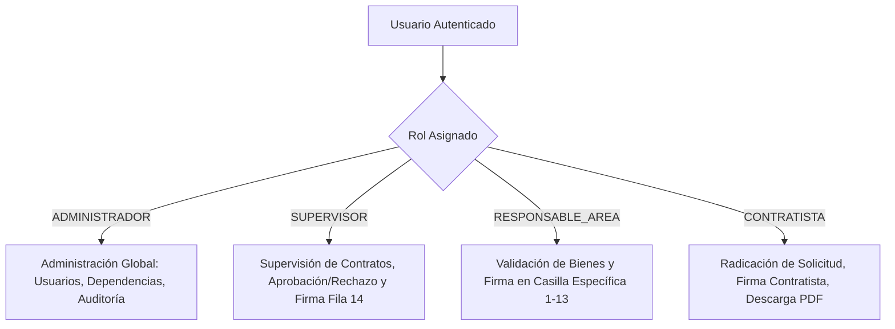
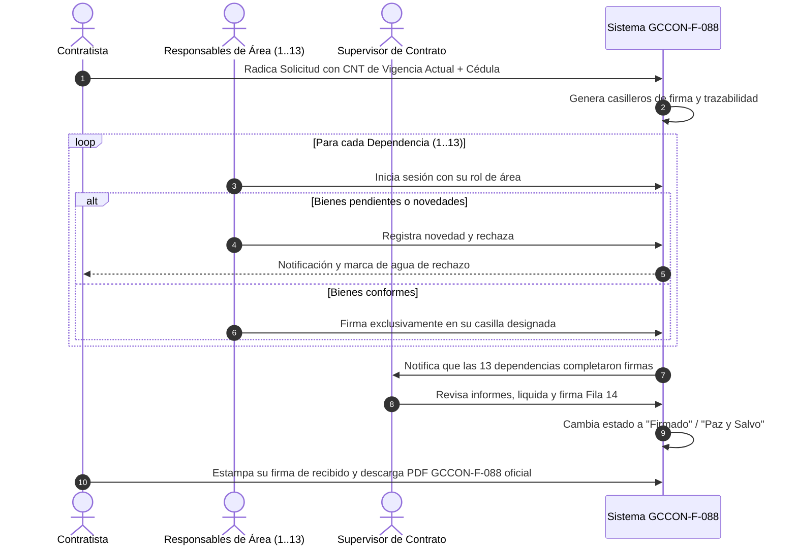

# Documento de Requisitos de Producto (PRD)
## Sistema de Gestión de Paz y Salvo Contractual (SENA GCCON-F-088)

**Versión:** 1.0  
**Fecha:** Octubre 2026  
**Estado:** Aprobado / En Producción  
**Autor:** Equipo de Desarrollo e Innovación Tecnológica (Centro Agroturístico San Gil - Regional Santander)  

---

## 1. Visión General del Producto

### 1.1 Declaración del Problema
Tradicionalmente en el SENA, el trámite de liquidación y expedición de Paz y Salvo de contratistas de prestación de servicios se realizaba mediante el diligenciamiento físico o itinerante del formato institucional **GCCON-F-088** (*"Entrega de Bienes e Información de Ejecución Contractual por el Contratista"*). 

Este procedimiento manual generaba:
- **Tiempos de espera excesivos:** Los contratistas debían desplazarse físicamente o enviar correos a más de 14 dependencias distintas para recolectar firmas individuales.
- **Falta de trazabilidad sobre inventarios y bienes:** Dificultad para rastrear equipos de cómputo, carnets, libros de biblioteca o elementos de almacén pendientes de devolución.
- **Vulnerabilidad en suplantación y validación:** Riesgo de firmas no autorizadas o sin verificación de identidad.
- **Falta de aislamiento de información:** Visibilidad indiscriminada de contratos ajenos entre contratistas.

### 1.2 Propuesta de Valor y Visión
El **Sistema de Paz y Salvo SENA GCCON-F-088** es una plataforma web progresiva que digitaliza y automatiza el flujo completo de liquidación contractual. Permite a los contratistas radicar solicitudes con su vigencia anual correspondiente, habilita a los responsables de área para validar bienes y estampar su firma digitalizada en sus respectivas casillas, y faculta a los supervisores para auditar y emitir el certificado oficial final idéntico al estándar institucional del SENA.

---

## 2. Objetivos del Producto (OKRs / KPIs)

| Objetivo Estratégico | Indicador Clave (KPI) | Meta |
| :--- | :--- | :--- |
| **Agilidad del trámite** | Tiempo promedio desde radicación hasta paz y salvo emitido | Reducir de 15 días a menos de 48 horas |
| **Cero suplantación** | Firmas no autorizadas en casillas ajenas | 0% (Validación estricta RBAC por identidad) |
| **Confiabilidad de inventario** | Devolución verificada de bienes antes de la firma | 100% de bienes inventariados validados |
| **Fidelidad normativa** | Cumplimiento estético y estructural del formato GCCON-F-088 | 100% conforme a los lineamientos SENA |

---

## 3. Usuarios y Roles (Matriz RBAC)

El sistema opera bajo un esquema de **Control de Acceso Basado en Roles (RBAC)** estricto:



### 3.1 Contratista (`CONTRATISTA`)
- **Alcance:** Solo visualiza sus propias solicitudes y contratos.
- **Funcionalidades:**
  - Radicar nueva solicitud seleccionando vigencia anual (`CNT-YYYY-XXX`), supervisor y dependencia.
  - Verificación y carga automática de su identificación oficial (Cédula de Ciudadanía).
  - Adjuntar soportes/informes finales en formato PDF.
  - Firma manuscrita digitalizada en el panel exclusivo del contratista.
  - Consulta en tiempo real de novedades u observaciones si su trámite es rechazado.
  - Descarga e impresión del PDF oficial GCCON-F-088 una vez completado.

### 3.2 Responsable de Área (`RESPONSABLE_AREA`)
- **Alcance:** Encargados institucionales de las dependencias evaluadoras (TIC, Almacén, Contabilidad, Tesorería, Biblioteca, SIGA, etc.).
- **Funcionalidades:**
  - Bandeja de solicitudes pendientes de firma en su área.
  - Acceso restringido a firma: **únicamente puede firmar la fila que le corresponde por nombre/cargo** (ej. Franklin Chacón en TIC; Zaida Melgarejo en Contabilidad; Johon Sanabria en Coordinación).
  - Registrar observaciones o novedades de bienes faltantes para suspender el paz y salvo.

### 3.3 Supervisor (`SUPERVISOR`)
- **Alcance:** Gestión de los contratos asignados a su supervisión técnica y administrativa.
- **Funcionalidades:**
  - Filtrado y auditoría de contratos a su cargo.
  - Validación del cumplimiento de todas las dependencias precedentes.
  - Aprobación o Rechazo formal de la solicitud contractual con motivo detallado.
  - Estampado de la firma de supervisión en la **Fila 14 (SUPERVISOR DE CONTRATO)**.

### 3.4 Administrador (`ADMINISTRADOR`)
- **Alcance:** Control total y gobierno del sistema.
- **Funcionalidades:**
  - Gestión integral (CRUD) de Usuarios, Contratistas, Supervisores y Dependencias.
  - Activación/Desactivación de dependencias y personas con confirmación personalizada por nombre (sin códigos crudos).
  - Configuración y parametrización de versiones del formato GCCON-F-088.
  - Módulo de auditoría forense y trazabilidad de eventos.

---

## 4. Requerimientos Funcionales (RF)

### 4.1 Módulo de Autenticación y Perfil
- **RF-01 (Inicio de Sesión):** Autenticación mediante correo institucional y contraseña con hashing bcrypt y generación de token JWT.
- **RF-02 (Aislamiento de Contratistas):** Si el usuario conectado tiene rol `CONTRATISTA`, el backend y frontend filtran automáticamente el listado para mostrar única y exclusivamente sus contratos/solicitudes.
- **RF-03 (Expiración y Renovación de Sesión):** Manejo de inactividad, cierre de sesión y redirección protegida por Route Guards.

### 4.2 Módulo de Gestión de Contratos y Solicitudes
- **RF-04 (Vigencia Anual Dinámica):** Los contratos admiten actualización anual de nomenclatura (ej. `CNT-2025-088` a `CNT-2026-001`), preservando el historial por contratista.
- **RF-05 (Identificación Oficial):** Captura y persistencia obligatoria del número de documento/cédula del contratista, evitando marcadores de posición (`—` o identificaciones genéricas de prueba).
- **RF-06 (Radicación de Trámites):** Formulario guiado en Quasar para crear solicitudes con número de contrato, contratista, cédula, dependencia, objeto y adjuntos PDF.
- **RF-07 (Confirmación Humanizada de Desactivación):** Los diálogos de confirmación para desactivar dependencias, contratistas o usuarios deben mostrar explícitamente el nombre de la entidad o persona (ej. *"¿Desactivar la dependencia Gestión Tecnológica (TIC)?"*).

### 4.3 Módulo de Validación de Bienes y Circuito de Firmas
- **RF-08 (Cuadrícula Oficial GCCON-F-088):** Matriz oficial compuesta por 14 filas fijas correspondientes a las áreas del Centro de Formación:
  1. Gestión de TIC
  2. Administración de Documentos
  3. Coordinación de Área/Grupo/Académica
  4. Almacén e Inventarios
  5. Servicios Generales
  6. Contabilidad
  7. Tesorería
  8. Coordinación Académica
  9. Biblioteca
  10. Lider SIGA
  11. Administración Educativa
  12. Seguimiento a Procesos Administrativos y Novedades
  13. Apoyo Etapa Productiva
  14. Supervisor de Contrato
- **RF-09 (Firma Biométrica / Manuscrita en Canvas):** Componente interactivo HTML5 Canvas con soporte para lápiz óptico, touch y ratón, generación de Base64 PNG transparente.
- **RF-10 (Control Estricto de Firma por Casilla):** Validación criptográfica y lógica: si un responsable intenta firmar en la casilla de otra persona, el sistema bloquea la acción emitiendo una notificación de seguridad con el nombre del titular autorizado.
- **RF-11 (Firma del Contratista):** Casilla independiente al pie del formato para la firma del contratista.

### 4.4 Módulo de Rechazo, Novedades y Paz y Salvo
- **RF-12 (Retención por Rechazo):** Si un área o supervisor rechaza la solicitud:
  - Se estampa marca de agua diagonal: *"SOLICITUD RECHAZADA - NO VÁLIDO"*.
  - Se retiene la validez de la firma del contratista.
  - Se despliega el banner de novedades con los bienes pendientes de devolución.
- **RF-13 (Limpieza de Novedades al Aprobar):** Una vez solventadas las devoluciones y firmadas todas las áreas, el estado pasa a *"Firmado"* / *"Paz y Salvo"*, eliminando cualquier residuo de observaciones de rechazo anteriores.

### 4.5 Módulo de Generación y Edición del Formato GCCON-F-088
- **RF-14 (Fidelidad Visual GCCON-F-088):** Cabecera oficial SENA, logo institucional, versión 1, código GCCON-F-088, tabla de clasificación de información (Pública, Pública Clasificada, Pública Reservada).
- **RF-15 (Modal de Edición de Formato):** Capacidad de ajustar metadatos del certificado (Ciudad Santander, Regional, Cédula, Fechas y Causales de Terminación: Mutuo Acuerdo, Cesión, Terminación Unilateral) con persistencia local y sincronización con el servidor.

---

## 5. Requerimientos No Funcionales (RNF)

- **RNF-01 (Seguridad & OWASP):** Headers de seguridad Helmet, limitación de tasa (Rate Limiting), sanitización de inputs contra NoSQL Injection y XSS.
- **RNF-02 (Rendimiento):** Tiempo de renderizado de la cuadrícula GCCON-F-088 inferior a 300 ms; generación de vista previa de firma en menos de 100 ms.
- **RNF-03 (Compatibilidad y Responsividad):** Interfaz optimizada para pantallas de escritorio, portátiles y tablets con resolución mínima de 1024x768.
- **RNF-04 (Impresión y Exportación):** Reglas CSS `@media print` para exportación a PDF en tamaño Carta (Letter) con saltos de página controlados y márgenes institucionales sin cortes indeseados.
- **RNF-05 (Disponibilidad y Concurrencia):** Arquitectura desacoplada basada en Node.js Express capaz de atender múltiples firmas concurrentes.

---

## 6. Arquitectura del Sistema

```mermaid
flowchart LR
    subgraph Frontend["Frontend (Vue 3 + Quasar)"]
        UI[Vistas / Páginas]
        Stores[Pinia Stores: auth, solicitudes, contratistas, etc.]
        Canvas[FirmaCanvas Component]
        API_Client[Axios Interceptors / Auth Token]
    end

    subgraph Backend["Backend (Node.js + Express)"]
        Routes[API Routes: /auth, /contratos, /usuarios, /dependencias]
        Middlewares[Auth JWT, RBAC Guard, Error Handler]
        Controllers[Controladores de Negocio]
        Services[Auditoría, Trazabilidad, Cache]
        Mongoose[Mongoose ODM]
    end

    subgraph Database["Base de Datos (MongoDB Atlas / Local)"]
        ColUsers[(usuarios)]
        ColContracts[(contratos_gccon_f088)]
        ColDeps[(dependencias_areas)]
        ColSignatures[(trazabilidad_firmas)]
        ColAudit[(auditoria_eventos)]
    end

    UI --> Stores
    Canvas --> UI
    Stores --> API_Client
    API_Client --> Routes
    Routes --> Middlewares
    Middlewares --> Controllers
    Controllers --> Services
    Controllers --> Mongoose
    Mongoose --> Database
```



---

## 7. Modelo de Datos Principal (Esquema Conceptual)

### 7.1 Colección `contratos_gccon_f088`
```json
{
  "_id": "ObjectId",
  "numero_contrato": "CNT-2026-001",
  "nombre_contratista": "Anderson Alexis Vargas Sanabria",
  "documento_contratista": "1098765432",
  "correo_contratista": "anderson.vargas@correo.com",
  "telefono": "3101234567",
  "dependencia": "ObjectId(DependenciaArea)",
  "usuario": "ObjectId(Usuario)",
  "supervisor": "ObjectId(Usuario)",
  "estado": "En revisión | Firmado | Rechazado | Finalizado",
  "observaciones_supervisor": "String | null",
  "version_formato": 1,
  "createdAt": "ISODate",
  "updatedAt": "ISODate"
}
```

### 7.2 Colección `trazabilidad_firmas`
```json
{
  "_id": "ObjectId",
  "contrato_id": "ObjectId(Contrato)",
  "area_id": "ObjectId(DependenciaArea)",
  "usuario_firmante_id": "ObjectId(Usuario)",
  "fila_formato_id": 1,
  "estado": "Pendiente | Firmado | Observado",
  "firma_base64": "data:image/png;base64,...",
  "fecha_firma": "ISODate",
  "hash_verificacion": "SHA256"
}
```

---

## 8. Diagrama de Flujo del Trámite de Paz y Salvo



---

## 9. Roadmap de Entregas y Estado Actual

- [x] **Fase 1: Fundamentos y UI/UX** (Diseño Quasar, cuadrícula oficial GCCON-F-088, canvas de firma).
- [x] **Fase 2: RBAC y Seguridad** (Aislamiento de solicitudes por contratista, protección de firmas cruzadas).
- [x] **Fase 3: Gestión Contractual Anual** (Nomenclatura dinámica de contratos por año/vigencia).
- [x] **Fase 4: Identificación & Datos GCCON-F-088** (Mapeo fidedigno de cédulas, autocompletado en solicitud, modal de edición de metadatos, limpieza de novedades resueltas).
- [ ] **Fase 5 (Próxima):** Integración con firma digital PKI / Certicamara y almacenamiento de certificados en repositorio institucional S3/Blob Storage.
