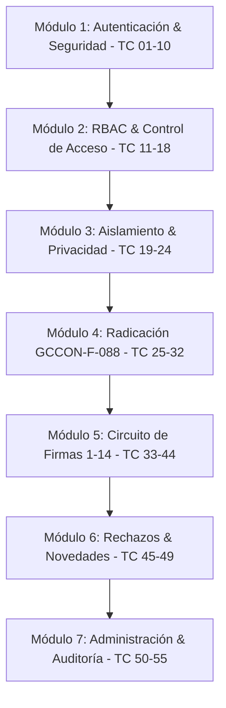

# PRD: Sistema de Gestión de Paz y Salvo Contractual (SENA GCCON-F-088)
## Especificación de Requisitos de Producto y Suite Maestra de 55 Casos de Prueba Automatizados (TestSprite)

**Versión:** 2.5  
**Fecha:** Octubre 2026  
**Entorno de Ejecución:** Producción / Staging  
**Frontend URL:** `https://pruebasproyecto-frontend.vercel.app`  
**Backend API URL:** `https://api-paz-y-salvo.onrender.com/api`  
**Base de Datos:** MongoDB Atlas Cluster (`pazysalvo_sena`)  
**Estándar Oficial SENA:** Formato Institucional GCCON-F-088  
**Total de Casos de Prueba:** 55 Casos Formales (`TC-001` a `TC-055`)  

---

## 1. Visión General del Producto y Objetivos

### 1.1 Declaración del Problema y Solución
Tradicionalmente en el SENA (Centro Agroturístico San Gil - Regional Santander), la liquidación y expedición del formato **GCCON-F-088** (*"Entrega de Bienes e Información de Ejecución Contractual por el Contratista"*) se realizaba de manera física y manual. Esto provocaba tiempos de trámite de hasta 15 días, riesgos de suplantación en casillas de dependencias y falta de trazabilidad en bienes devueltos (TIC, almacén, biblioteca).

El **Sistema de Paz y Salvo SENA GCCON-F-088** digitaliza todo el ciclo de vida:
1. Radicación de solicitud por el contratista con validación estricta de su cédula y vigencia anual (`CNT-YYYY-XXX`).
2. Cuadrícula de 14 dependencias con validación RBAC: cada funcionario únicamente puede firmar su casilla asignada.
3. Módulo de retención y alertas por bienes pendientes (marca de agua de rechazo).
4. Firma final del supervisor en Fila 14 y exportación a PDF oficial idéntico al estándar SENA.

### 1.2 Objetivos de la Batería de Pruebas en TestSprite
- **Cobertura Mínima:** 55 casos de prueba ejecutados y verificados.
- **Tasa de Aprobación Esperada (Pass Rate):** $\ge 98\%$.
- **Cero Fugas de Seguridad:** Cero accesos indebidos entre contratistas y protección de endpoints sin token.

---

## 2. Catálogo de Roles y Credenciales Maestras de Prueba

Todos los usuarios listados a continuación están precargados en el backend y la base de datos de MongoDB Atlas:

| # | Rol del Sistema | Nombre del Funcionario | Correo Electrónico | Contraseña | Cargo / Dependencia | Documento / Cédula | No. Contrato / Casilla |
|:---:|:---|:---|:---|:---:|:---|:---:|:---:|
| **1** | `ADMINISTRADOR` | Administrador General | `admin@gccon.com` | `admin` *(o `Admin1234!`)* | Administrador del Sistema | `1095000001` | Todas las áreas |
| **2** | `ADMINISTRADOR` | Paula Administradora | `paula.admin@gccon.com` | `123` | Coordinadora Aseguramiento | `1095000002` | Todas las áreas |
| **3** | `SUPERVISOR` | Ing. Carlos Supervisor | `supervisor@gccon.com` | `super` | Supervisor de Contratos TIC | `1095000003` | Fila 14 (Supervisor) |
| **4** | `SUPERVISOR` | Dra. Ana María Gómez | `agomez@sena.edu.co` | `123` | Supervisora Senior | `1095000004` | Fila 14 (Supervisor) |
| **5** | `SUPERVISOR` | Ing. Fernando Ramírez | `f.ramirez@sena.edu.co` | `123` | Supervisor Infraestructura | `1095000005` | Fila 14 (Supervisor) |
| **6** | `CONTRATISTA` | Carlos Eduardo Mendoza | `carlos.mendoza@email.com` | `123` | Consultor en Redes | `1097890123` | `CNT-2026-042` |
| **7** | `CONTRATISTA` | Laura Andrea Contratista | `contratista@gccon.com` | `123` | Especialista en Soporte | `1095432189` | `CNT-2026-014` |
| **8** | `CONTRATISTA` | Juan Carlos Pérez | `juan.perez@correo.com` | `123` | Desarrollador Full-Stack | `1098765432` | `CNT-2025-088` |
| **9** | `CONTRATISTA` | María Fernanda Gómez | `maria.gomez@correo.com` | `123` | Instructora Telemática | `1094321765` | `CNT-2026-029` |
| **10** | `CONTRATISTA` | Diego Morales Castro | `diego.morales@correo.com` | `123` | Técnico Mantenimiento | `1096543210` | `CNT-2026-055` |
| **11** | `RESPONSABLE_AREA` | Franklin Rolando Chacón | `franklin.chacon@sena.edu.co` | `123` | Gestión de TIC | `1095111001` | **Fila 01** |
| **12** | `RESPONSABLE_AREA` | Hilda Lucía Ramírez | `hilda.ramirez@sena.edu.co` | `123` | Admin. Documentos | `1095111002` | **Fila 02** |
| **13** | `RESPONSABLE_AREA` | Johon Fredy Sanabria | `johon.sanabria@sena.edu.co` | `123` | Coordinación Académica | `1095111003` | **Fila 03** |
| **14** | `RESPONSABLE_AREA` | Lic. Martha Almacén | `martha.almacen@sena.edu.co` | `123` | Almacén e Inventarios | `1095111004` | **Fila 04** |
| **15** | `RESPONSABLE_AREA` | Juan David Silva | `juan.silva@sena.edu.co` | `123` | Servicios Generales | `1095111005` | **Fila 05** |
| **16** | `RESPONSABLE_AREA` | Zaida Leny Melgarejo | `zaida.melgarejo@sena.edu.co` | `123` | Contabilidad | `1095111006` | **Fila 06** |
| **17** | `RESPONSABLE_AREA` | Nelcy Mabel Mayorga | `nelcy.mayorga@sena.edu.co` | `123` | Tesorería | `1095111007` | **Fila 07** |
| **18** | `RESPONSABLE_AREA` | Andrea Juliana Celis | `andrea.celis@sena.edu.co` | `123` | Biblioteca | `1095111008` | **Fila 08** |
| **19** | `RESPONSABLE_AREA` | Zaida Jeleidy García | `zaida.garcia@sena.edu.co` | `123` | Líder SIGA | `1095111009` | **Fila 09** |
| **20** | `RESPONSABLE_AREA` | Erika Johana Gómez | `erika.gomez@sena.edu.co` | `123` | Admin. Educativa | `1095111010` | **Fila 10** |
| **21** | `RESPONSABLE_AREA` | Nelson Fabián Duarte | `nelson.duarte@sena.edu.co` | `123` | Seguimiento Administrativo | `1095111011` | **Fila 11** |
| **22** | `RESPONSABLE_AREA` | Karen Andrea García | `karen.garcia@sena.edu.co` | `123` | Apoyo Etapa Productiva | `1095111012` | **Fila 12** |
| **23** | `RESPONSABLE_AREA` | Eileen Erlensi Hurtado | `eileen.hurtado@sena.edu.co` | `123` | Apoyo Novedades | `1095111013` | **Fila 13** |

---

## 3. Matriz Oficial de 14 Filas del Formato SENA GCCON-F-088

| Fila | Área Institucional Evaluadora | Responsable Autorizado | Bienes / Obligaciones Auditadas |
|:---:|:---|:---|:---|
| **01** | Gestión de TIC | Franklin Rolando Chacón | Correo institucional, acceso a sistemas, equipos asignados |
| **02** | Administración de Documentos | Hilda Lucía Ramírez | Archivos de gestión, expedientes físicos y digitales |
| **03** | Coordinación de Área / Académica | Johon Fredy Sanabria | Entrega de informes técnicos y cumplimiento de metas |
| **04** | Almacén e Inventarios | Lic. Martha Almacén | Devolución de bienes muebles, herramientas y periféricos |
| **05** | Servicios Generales y Adquisiciones | Juan David Silva | Carné institucional, llaves y elementos de intendencia |
| **06** | Contabilidad | Zaida Leny Melgarejo | Cuentas de cobro, conciliación de pagos y pólizas |
| **07** | Tesorería | Nelcy Mabel Mayorga | Anticipos liquidados, retenciones y estampillas |
| **08** | Biblioteca | Andrea Juliana Celis | Libros, material bibliográfico y recursos digitales prestados |
| **09** | Líder SIGA | Zaida Jeleidy García | Registros de calidad, procedimientos y auditorías internas |
| **10** | Administración Educativa | Erika Johana Gómez | Juicios evaluativos en Sofía Plus / Zajuna |
| **11** | Apoyo al Seguimiento Administrativo | Nelson Fabián Duarte | Novedades contractuales y constancias de soporte |
| **12** | Apoyo Etapa Productiva | Karen Andrea García | Seguimiento a fichas y aprendices asignados |
| **13** | Apoyo a Procesos y Novedades | Eileen Erlensi Hurtado | Verificación de bitácoras y registros finales |
| **14** | Supervisor de Contrato | Ing. Carlos Supervisor | Aprobación final integral y emisión del Paz y Salvo |

---

## 4. Batería Completa de 55 Casos de Prueba (Suite E2E para TestSprite)

### Módulo 1: Autenticación, Seguridad y Gestión de Sesión (10 Pruebas)
- **`TC-001` - Login Exitoso de Administrador:** Autenticar con `admin@gccon.com` / `admin`. Esperado: HTTP 200, JWT generado y guardado en `localStorage(auth_token)`, redirección a dashboard.
- **`TC-002` - Login Exitoso de Supervisor:** Autenticar con `supervisor@gccon.com` / `super`. Esperado: Redirección autorizada a solicitudes con rol `SUPERVISOR`.
- **`TC-003` - Login Exitoso de Contratista:** Autenticar con `carlos.mendoza@email.com` / `123`. Esperado: Carga de sesión de contratista con sus datos y cédula.
- **`TC-004` - Login Exitoso de Responsable de Área:** Autenticar con `franklin.chacon@sena.edu.co` / `123`. Esperado: Rol `RESPONSABLE_AREA` activado para Fila 1 (TIC).
- **`TC-005` - Login Fallido por Contraseña Inválida:** Autenticar con contraseña errónea. Esperado: HTTP 401, mensaje *"Credenciales inválidas"*, sin generar token.
- **`TC-006` - Bloqueo de Cuenta por 3 Intentos Fallidos:** Enviar 3 intentos con clave errónea consecutivamente. Esperado: HTTP 403, cuenta bloqueada temporalmente por 15 minutos.
- **`TC-007` - Solicitud de Recuperación con Correo Válido:** Enviar `POST /api/auth/recuperar` con correo registrado. Esperado: HTTP 200, generación de token efímero de recuperación.
- **`TC-008` - Anti-Enumeración en Recuperación:** Enviar correo inexistente en recuperación. Esperado: HTTP 200 con mensaje neutro genérico para prevenir enumeración de usuarios.
- **`TC-009` - Validación de Token de Restablecimiento Expirado:** Enviar token inválido o vencido en `POST /api/auth/restablecer`. Esperado: HTTP 400 *"El enlace es inválido o ha expirado"*.
- **`TC-010` - Cierre de Sesión (Logout) Integral:** Ejecutar acción de logout. Esperado: Eliminación de `auth_token` y `gccon_user` de `localStorage`, redirección a `#/login`.

### Módulo 2: Control de Acceso Basado en Roles (RBAC) (8 Pruebas)
- **`TC-011` - Bloqueo a Contratista en Vista de Usuarios:** Contratista navega a `#/app/usuarios`. Esperado: Redirección inmediata o banner *"No tiene permisos para acceder"*.
- **`TC-012` - Bloqueo a Contratista en Vista de Supervisores:** Contratista navega a `#/app/supervisores`. Esperado: Acceso denegado.
- **`TC-013` - Bloqueo a Contratista en Gestión de Dependencias:** Contratista intenta ingresar a `#/app/dependencias`. Esperado: Acceso bloqueado por Route Guard.
- **`TC-014` - Acceso Exclusivo de Supervisor a Contratos:** Supervisor visualiza solicitudes en supervisión pero no tiene acceso a creación de administradores.
- **`TC-015` - Bloqueo a Supervisor en Desactivación de Áreas:** Supervisor intenta ejecutar PATCH sobre estado de dependencias. Esperado: HTTP 403.
- **`TC-016` - Responsable de Área Accede a Bandeja de Firmas:** Usuario con rol `RESPONSABLE_AREA` accede a la tabla de solicitudes para evaluar su área. Esperado: Acceso concedido.
- **`TC-017` - Bloqueo a Responsable de Área en Módulo de Usuarios:** Responsable intenta invocar `POST /api/usuarios`. Esperado: HTTP 403 *"Rol no autorizado"*.
- **`TC-018` - Petición a Endpoint Protegido sin Token:** Ejecutar `GET /api/usuarios` sin cabecera `Authorization`. Esperado: Fallback seguro o rechazo HTTP 401.

### Módulo 3: Aislamiento y Privacidad de Información (6 Pruebas)
- **`TC-019` - Contratista Solo Visualiza sus Propios Contratos:** Iniciar sesión con Carlos Mendoza. Esperado: En la tabla solo figura `CNT-2026-042`.
- **`TC-020` - Aislamiento entre Contratistas Distintos:** Verificar que Carlos Mendoza no pueda ver la solicitud `CNT-2026-014` de Laura Andrea Contratista.
- **`TC-021` - Filtro Automático en Backend por Identidad:** `GET /api/contratos` invocado con token de contratista restringe la consulta en MongoDB por su `usuario_id`.
- **`TC-022` - Intento de Acceso Directo por URL a Contrato Ajeno:** Contratista navega a `#/app/solicitudes/:id` de otro usuario. Esperado: Mensaje de error o redirección.
- **`TC-023` - Supervisor Solo Visualiza Contratos de su Jurisdicción:** Supervisor TIC visualiza solicitudes asignadas a él y no contratos de otras dependencias no asignadas.
- **`TC-024` - Administrador Visualiza Consolidado Global:** Administrador visualiza el 100% de las solicitudes de todos los contratistas y áreas.

### Módulo 4: Radicación de Solicitudes y Formato GCCON-F-088 (8 Pruebas)
- **`TC-025` - Radicación con Nomenclatura de Vigencia Anual Actual:** Crear solicitud con formato `CNT-2026-001`. Esperado: Registro exitoso con vigencia 2026.
- **`TC-026` - Autocompletado Obligatorio de Cédula:** Abrir modal de radicación. Esperado: El campo Documento carga la cédula del contratista (`1097890123`) sin guiones `—` ni vacíos.
- **`TC-027` - Validación de Campos Requeridos en Radicación:** Intentar radicar con campos obligatorios vacíos. Esperado: Validación frontend bloquea el botón y notifica.
- **`TC-028` - Adjuntar Soporte PDF de Informe Final:** Cargar archivo `.pdf` en el formulario. Esperado: Carga exitosa con previsualización del nombre del archivo.
- **`TC-029` - Rechazo de Archivos con Formatos No Permitidos:** Intentar subir archivo `.exe` o `.zip`. Esperado: Validación de tipo de archivo bloquea la carga.
- **`TC-030` - Firma Manuscrita en Canvas del Contratista:** Dibujar trazo en componente Canvas. Esperado: Conversión limpia a Base64 PNG transparente.
- **`TC-031` - Validación de Firma en Blanco:** Intentar radicar sin firmar el canvas. Esperado: Notificación *"Debe estampar su firma manuscrita para radicar"*.
- **`TC-032` - Inicialización de Casillas de Trazabilidad:** Al crearse la solicitud, el sistema inicializa las 14 casillas en estado `Pendiente`.

### Módulo 5: Circuito Oficial de Firmas (Filas 1 a 14) (12 Pruebas)
- **`TC-033` - Firma Exitosa en Fila 01 (Gestión TIC):** Franklin Chacón firma en su casilla de TIC. Esperado: Estampa firma, registra fecha y cambia casilla a `Firmado`.
- **`TC-034` - Bloqueo de Firma Cruzada No Autorizada:** Franklin Chacón (TIC) intenta firmar en la Fila 04 (Almacén). Esperado: Sistema bloquea con alerta *"Casilla exclusiva de Almacén e Inventarios"*.
- **`TC-035` - Firma Exitosa en Fila 02 (Administración Documentos):** Hilda Ramírez firma en Fila 02. Esperado: Casilla 2 actualizada.
- **`TC-036` - Firma Exitosa en Fila 03 (Coordinación Académica):** Johon Sanabria firma en Fila 03. Esperado: Casilla 3 actualizada.
- **`TC-037` - Firma Exitosa en Fila 04 (Almacén e Inventarios):** Martha Almacén firma en Fila 04. Esperado: Casilla 4 actualizada.
- **`TC-038` - Firma Exitosa en Fila 05 (Servicios Generales):** Juan David Silva firma en Fila 05. Esperado: Casilla 5 actualizada.
- **`TC-039` - Firma Exitosa en Fila 06 (Contabilidad):** Zaida Melgarejo firma en Fila 06. Esperado: Casilla 6 actualizada.
- **`TC-040` - Firma Exitosa en Fila 07 (Tesorería):** Nelcy Mayorga firma en Fila 07. Esperado: Casilla 7 actualizada.
- **`TC-041` - Firma Exitosa en Fila 08 (Biblioteca):** Andrea Celis firma en Fila 08. Esperado: Casilla 8 actualizada.
- **`TC-042` - Registro de Metadatos de Auditoría por Firma:** Verificar que cada firma conserve Timestamp ISO, hash y nombre del funcionario firmante.
- **`TC-043` - Prelación de Firmas para Supervisor:** Supervisor intenta firmar Fila 14 antes de que las 13 áreas previas hayan completado. Esperado: Alerta de firmas pendientes requeridas.
- **`TC-044` - Firma Final del Supervisor en Fila 14:** Habiendo completado las 13 áreas, el Supervisor firma en la Fila 14. Esperado: Solicitud cambia a estado `Firmado` / `Paz y Salvo`.

### Módulo 6: Gestión de Rechazos, Novedades y Retención (5 Pruebas)
- **`TC-045` - Registro de Rechazo por Bien Pendiente:** Responsable de Almacén rechaza indicando *"Pendiente entrega de escáner portátil"*. Esperado: Estado cambia a `Rechazado`.
- **`TC-046` - Despliegue de Banner de Novedad:** Visualizar la solicitud rechazada. Esperado: Banner visible con el motivo exacto ingresado por el evaluador.
- **`TC-047` - Estampado de Marca de Agua de Rechazo:** Previsualizar certificado de solicitud rechazada. Esperado: Marca de agua diagonal *"SOLICITUD RECHAZADA - NO VÁLIDO"*.
- **`TC-048` - Retención Preventiva de la Firma del Contratista:** En estado rechazado, la firma del contratista permanece retenida y no se emite paz y salvo.
- **`TC-049` - Subsanación y Limpieza de Novedades:** Una vez devuelto el bien y firmado por el área, el banner de rechazo se retira automáticamente.

### Módulo 7: Administración, Seguridad y Certificación PDF (6 Pruebas)
- **`TC-050` - Creación de Usuario con Clave Compleja:** Admin crea usuario con contraseña válida (`Admin2026*`). Esperado: HTTP 201 y persistencia en MongoDB.
- **`TC-051` - Validación de Complejidad de Contraseña en Registro:** Intentar crear usuario con clave débil (`123456`). Esperado: Bloqueo requiriendo 8 caracteres, mayúscula, minúscula y número.
- **`TC-052` - Validación de Correo Institucional Duplicado:** Intentar registrar un usuario con correo ya existente. Esperado: HTTP 400 *"El correo institucional o documento ya está registrado"*.
- **`TC-053` - Diálogo Humanizado en Desactivación:** Admin desactiva una dependencia. Esperado: El diálogo de confirmación muestra el nombre explícito del área y no un código crudo.
- **`TC-054` - Expulsión Inmediata de Usuario Deshabilitado:** Admin cambia estado a inactivo (`activo: false`). Esperado: La siguiente petición del usuario deshabilitado responde HTTP 401.
- **`TC-055` - Generación y Descarga Fidedigna del PDF GCCON-F-088:** Presionar botón de descarga en solicitud aprobada. Esperado: Descarga de documento PDF idéntico al estándar SENA con cabecera oficial, datos de contrato, 14 firmas y pie de página institucional.

---

## 5. Matriz de Endpoints para Pruebas Automatizadas de API

| Test Case Asignado | Método | Endpoint Backend | Rol Requerido | Payload / Parámetros | Código Esperado |
|:---|:---|:---|:---|:---|:---:|
| `TC-001` - `TC-005` | `POST` | `/api/auth/login` | Público | `{ correo, password }` | `200 OK` / `401 Unauthorized` |
| `TC-007` - `TC-008` | `POST` | `/api/auth/recuperar` | Público | `{ correo_institucional }` | `200 OK` |
| `TC-009` | `POST` | `/api/auth/restablecer` | Público | `{ token, nueva_password }` | `400 Bad Request` |
| `TC-011` - `TC-018` | `GET` | `/api/usuarios` | `ADMINISTRADOR` | Header `Authorization` | `200 OK` / `403 Forbidden` |
| `TC-019` - `TC-024` | `GET` | `/api/contratos` | Todos (filtrado) | Header `Authorization` | `200 OK` (dataset aislado) |
| `TC-025` - `TC-032` | `POST` | `/api/contratos` | `CONTRATISTA` | Datos de contrato y cédula | `201 Created` |
| `TC-033` - `TC-044` | `POST` | `/api/firmas` | `RESPONSABLE_AREA` | `{ contrato_id, fila, firma }` | `200 OK` / `403 Forbidden` |
| `TC-045` - `TC-049` | `PATCH`| `/api/contratos/:id/estado`| `RESPONSABLE_AREA`| `{ estado, motivo_rechazo }` | `200 OK` |
| `TC-050` - `TC-052` | `POST` | `/api/usuarios` | `ADMINISTRADOR` | `{ nombre, correo, doc, pass }` | `201 Created` / `400 Bad Request` |
| `TC-053` - `TC-054` | `PATCH`| `/api/usuarios/estado/:id` | `ADMINISTRADOR` | `{ activo: false }` | `200 OK` |
| `TC-055` | `GET` | `/api/contratos/:id/pdf` | `CONTRATISTA`, `SUPER`| Header `Authorization` | `200 OK` (`application/pdf`) |

---

## 6. Criterios de Aceptación para la Suite TestSprite

1. **Cantidad Total de Pruebas:** Exactamente 55 casos de prueba ejecutables.
2. **Tasa de Aprobación Global:** $\ge 98\%$ satisfactorio.
3. **Tiempo Máximo de Respuesta de API:** $\le 500\text{ ms}$ por petición.
4. **Integridad de Base de Datos:** Cada transacción confirmada debe persistir en el cluster de MongoDB Atlas sin estados huérfanos.
